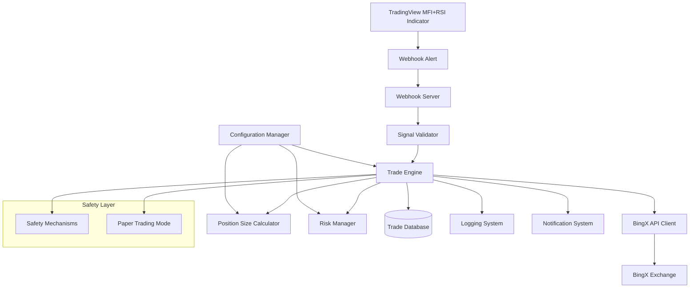

# BingX Futures Trading Bot Architecture

## Overview
This bot automatically executes futures trades on BingX based on MFI+RSI signals from TradingView webhooks, using percentage-based position sizing and dynamic risk management.

## System Architecture



## Core Components

### 1. Webhook Server
- **Purpose**: Receives HTTP POST requests from TradingView alerts
- **Features**: 
  - Express.js server with security middleware
  - IP whitelisting and authentication
  - Request validation and parsing
  - Rate limiting protection

### 2. Signal Validator
- **Purpose**: Validates and parses incoming TradingView signals
- **Features**:
  - Signal format validation
  - Symbol mapping (TradingView → BingX)
  - Signal strength assessment
  - Duplicate signal filtering

### 3. BingX API Client
- **Purpose**: Interfaces with BingX futures trading API
- **Features**:
  - Authentication management
  - Account balance retrieval
  - Position management
  - Order placement and monitoring
  - Error handling and retries

### 4. Position Size Calculator
- **Purpose**: Calculates trade size based on account balance percentage
- **Features**:
  - Percentage-based sizing (e.g., 2% of balance)
  - Leverage consideration
  - Maximum position limits
  - Balance validation

### 5. Risk Manager
- **Purpose**: Implements dynamic risk management strategies
- **Features**:
  - Stop-loss calculation based on volatility
  - Take-profit levels (multiple targets)
  - Trailing stop implementation
  - Maximum daily loss protection
  - Position correlation analysis

### 6. Trade Engine
- **Purpose**: Orchestrates the entire trading process
- **Features**:
  - Signal processing workflow
  - Order execution logic
  - Position monitoring
  - Trade lifecycle management
  - Emergency stop mechanisms

## Data Flow

1. **Signal Reception**: TradingView sends webhook with MFI+RSI signal
2. **Validation**: Signal is validated and parsed
3. **Risk Assessment**: Current positions and account status checked
4. **Position Sizing**: Calculate trade size based on account percentage
5. **Risk Parameters**: Set stop-loss and take-profit levels
6. **Order Execution**: Place order on BingX
7. **Monitoring**: Track order status and position
8. **Management**: Adjust stops, take profits as needed
9. **Logging**: Record all activities and performance

## Configuration Structure

```typescript
interface BotConfig {
  trading: {
    positionSizePercent: number;     // 2% of account balance
    maxDailyLoss: number;            // Maximum daily loss limit
    maxOpenPositions: number;        // Maximum concurrent positions
    leverageMultiplier: number;      // Leverage to use
  };
  
  riskManagement: {
    stopLossPercent: number;         // Default stop-loss percentage
    takeProfitPercent: number;       // Default take-profit percentage
    trailingStopPercent: number;     // Trailing stop percentage
    useVolatilityStops: boolean;     // Dynamic stops based on ATR
  };
  
  webhook: {
    port: number;                    // Server port
    secret: string;                  // Webhook authentication secret
    allowedIPs: string[];            // IP whitelist
  };
  
  bingx: {
    apiKey: string;                  // BingX API key
    secretKey: string;               // BingX secret key
    testnet: boolean;                // Use testnet for testing
  };
  
  notifications: {
    discord?: { webhook: string };
    telegram?: { botToken: string; chatId: string };
    email?: { smtp: object };
  };
}
```

## Security Considerations

1. **API Key Management**: Secure storage of BingX credentials
2. **Webhook Security**: Authentication and IP whitelisting
3. **Rate Limiting**: Prevent abuse and API limits
4. **Input Validation**: Sanitize all incoming data
5. **Error Handling**: Graceful failure without exposing sensitive data

## Monitoring & Logging

1. **Trade Logging**: All trades with timestamps and parameters
2. **Performance Metrics**: Win rate, profit/loss, drawdown
3. **System Health**: API connectivity, webhook status
4. **Alerts**: Critical errors, large losses, system failures

## Testing Strategy

1. **Paper Trading Mode**: Test without real money
2. **Unit Tests**: Individual component testing
3. **Integration Tests**: End-to-end workflow testing
4. **Backtesting**: Historical signal performance analysis